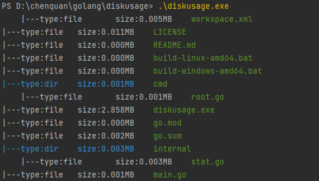

# diskusage

> A tool for showing disk usage.

## installation

```shell
go install github.com/chenquan/diskusage@latest
```

```
PS D:\chenquan\golang\diskusage> .\diskusage.exe -h
show disk usage.

Usage:
  diskusage [flags]

Flags:
  -d, --depth int     Shows the depth of the tree directory structure (default 3)
      --dir string    Dir path (default "./")
  -h, --help          help for diskusage
  -u, --unit string   Displayed units. optional: B(Bytes), K(KB), M(MB), G(GB), T(TB) (default "M")
```

## use

