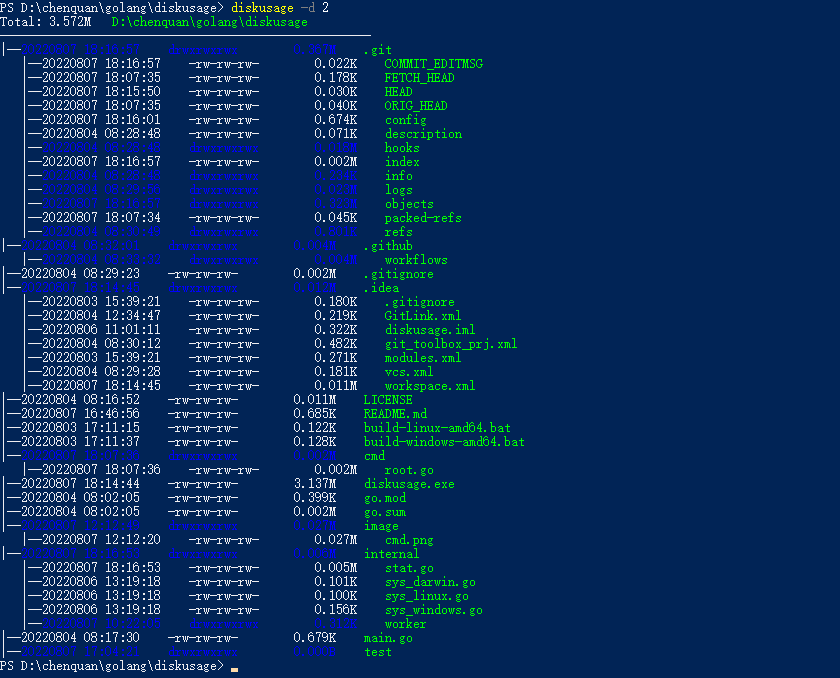

# diskusage

> A tool for showing disk usage.

## installation

```shell
go install github.com/chenquan/diskusage@latest
```
or [download](https://github.com/chenquan/diskusage/releases).

## how to use

```
$ diskusage -h
A tool for showing disk usage.

Usage:
  diskusage [flags]

Flags:
  -a, --all             display all directories, otherwise only display folders whose usage size is not 0
  -d, --depth int       shows the depth of the tree directory structure (default 1)
      --dir string      dir path (default "./")
  -f, --filter string   regular expression filter (default ".+")
  -h, --help            help for diskusage
  -t, --type strings    only count certain types of files  (default all)
  -u, --unit string     displayed units. optional: B(Bytes), K(KB), M(MB), G(GB), T(TB) (default "M")
```



## example
1. Only files named Doc or docx are counted: `diskusage -t doc,docx` or `diskusage -f ".+\.(doc|docx)$"`
2. The maximum display unit is G: `diskusage -u G`
3. supports color output to pipeline: `diskusage -c=always | less -R`
