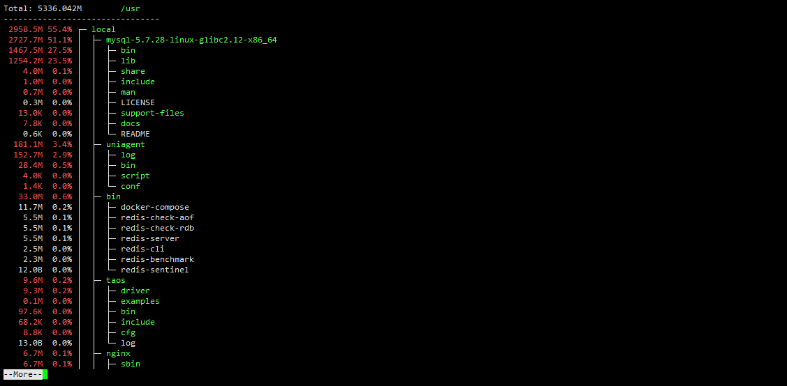

# diskusage

[](https://github.com/chenquan/diskusage)
[](https://github.com/chenquan/diskusage)
[](LICENSE)

English | [简体中文](README-CN.md)


A tool for showing disk usage. (Linux, macOS and Windows)



## 😜installation

```shell
go install github.com/chenquan/diskusage@latest
```

or [download](https://github.com/chenquan/diskusage/releases).

## 👏how to use

```
$ diskusage -h
A tool for showing disk usage.

GitHub: https://github.com/chenquan/diskusage
Issues: https://github.com/chenquan/diskusage/issues

Usage:
  diskusage [flags]

Examples:
1.The maximum display unit is GB: diskusage -u G
2.Only files named Doc or docx are counted:
  a.diskusage -t doc,docx
  b.diskusage -f ".+\.(doc|docx)$"
3.Supports color output to pipeline:
  a.diskusage -c always | less -R
  b.diskusage -c always | more
4.Displays a 2-level tree structure: diskusage -d 2
5.Specify the directory /usr: diskusage --dir /usr
6.Export disk usage to file: diskusage > diskusage.txt

Flags:
  -a, --all             display all directories, otherwise only display folders whose usage size is not 0
  -c, --color string    set color output mode. optional: auto, always, ignore (default "auto")
  -d, --depth int       shows the depth of the tree directory structure (default 1)
      --dir string      directory path (default "./")
  -f, --filter string   regular expressions are used to filter files
  -h, --help            help for diskusage
  -l, --limit int       limit the number of files and directories displayed (default 9223372036854775807)
  -t, --type strings    only count certain types of files  (default all)
  -u, --unit string     displayed units. optional: B(Bytes), K(KB), M(MB), G(GB), T(TB) (default "M")
  -v, --version         version for diskusage
  -w, --worker int      number of workers searching the directory (default 5120)
```

## 👀example

1. Only files named Doc or docx are counted: `diskusage -t doc,docx` or `diskusage -f ".+\.(doc|docx)$"`
2. The maximum display unit is GB: `diskusage -u G`
3. Supports color output to pipeline: `diskusage -c always | less -R` or `diskusage -c always | more`

If you like or are using this project to learn or start your solution, please give it a star⭐. Thanks!
